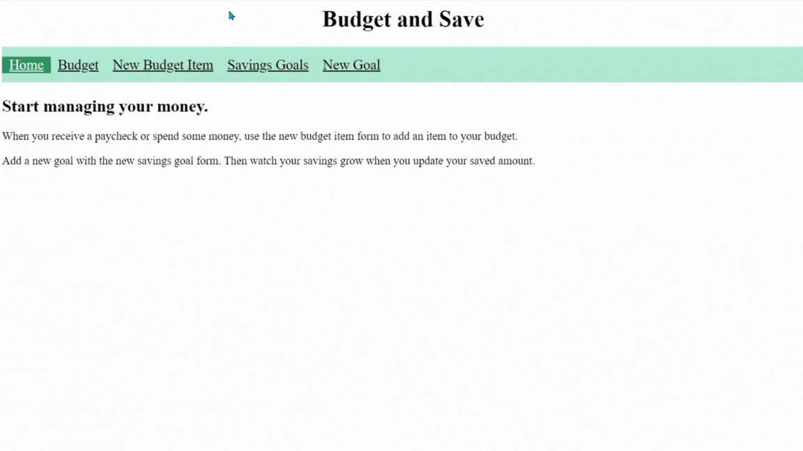
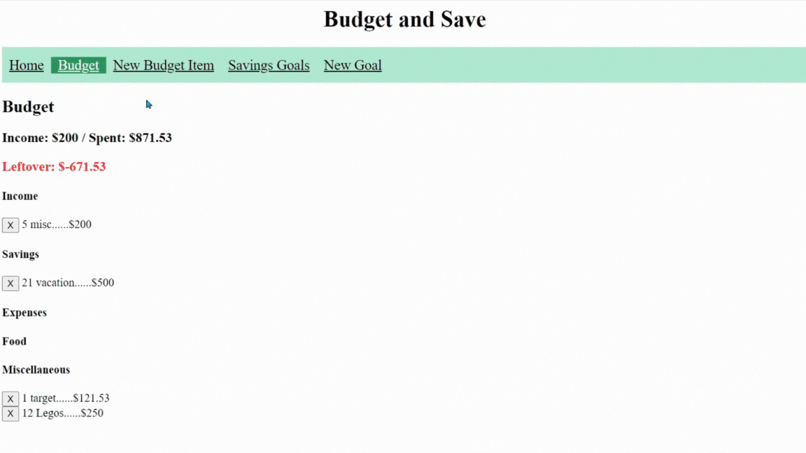
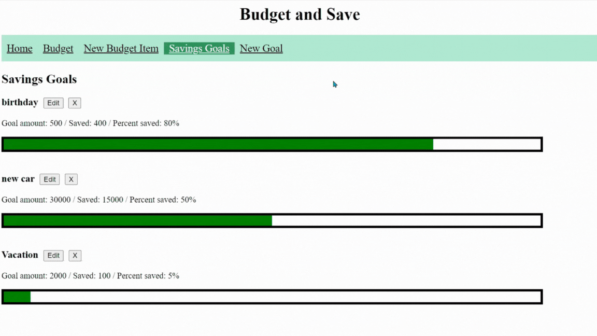
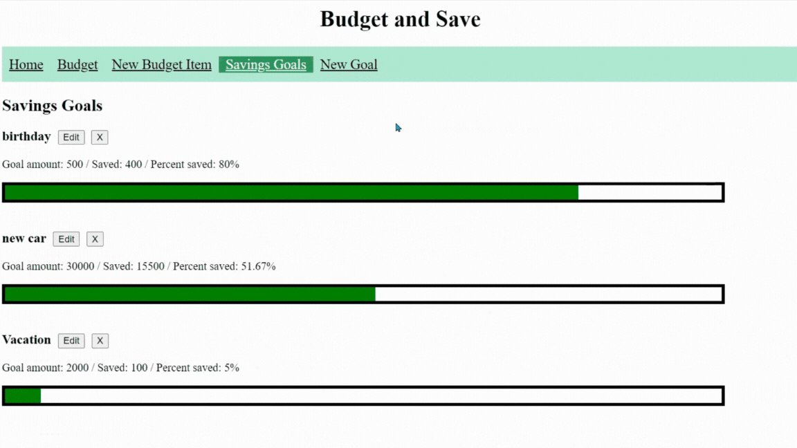

# Budget and Save App

When you receive a paycheck or spend some money, use the new budget item form to add an item to your budget.
Add a new goal with the new savings goal form. Then watch your savings grow when you update your saved amount.

## Budget

This page displays all budget items under their respective categories. The total income, total spent and leftover are displayed at the top of the page. The leftover will turn red or green depending on a negative or positive answer. There is a delete button next to each budget item. 

## New Budget Item Form

This form asks for the date, description, amount and category for a new budget item. When submitted, the page will be directed to the budget page. The new item will be inserted into the correct category and organized by date.

## Savings Goals

Each goal is shown with the total goal amount, total saved so far and the percentage of saved to goal amount. The bar fills up green based on the percentage. Each goal can be edited or deleted. If the edit button is clicked, a new saved amount can be entered.

## New Goal Form

This form asks for the description, goal amount and amount saved so far. When the form is submitted, the page will redirect to the savings goals page. The new goal will be inserted alphabetically. 

